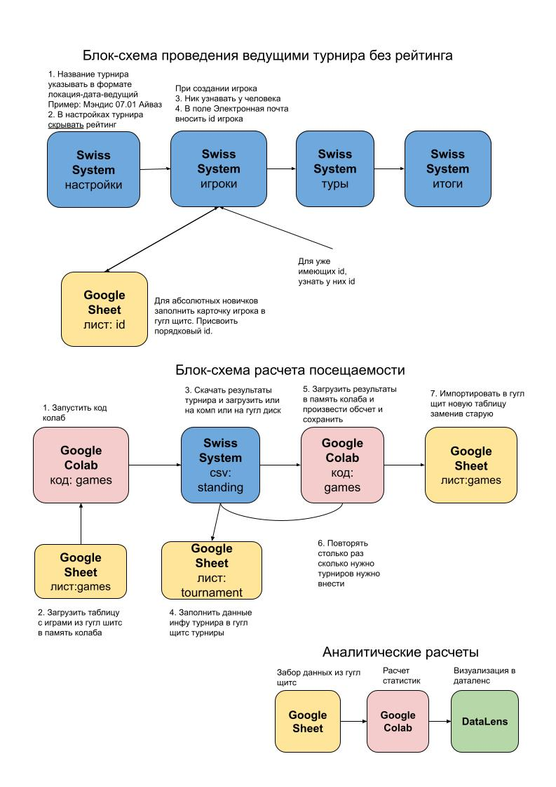
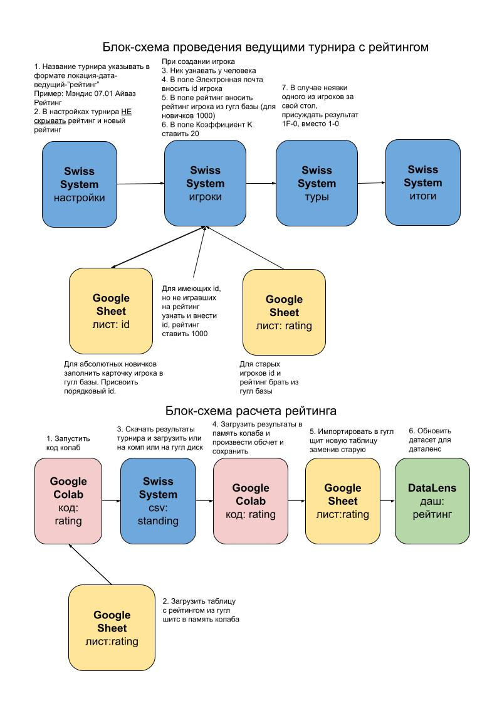

# О проекте

RepChess - это проект группы ребят из Москвы, бывших студентов, которые решили организовать своё шахматное комьюнити и организовывать живые шахматные турниры на разных площадках города. В 2024 году они провели более 350 живых турниров, которые посетило 10 000 участников. Я проявил интерес к их проекту, и хотя и не являлся частью их команды, выполнил для них некоторые задачи, которыми сами они к тому еще не занимались. 

# Я поставил себе следующие задачи
1. Выстроить систему сбора и хранения персонифицированной информации об игроках 
2. Введение и поддержание игрового рейтинга игроков
3. Ведение статистики посещаемости турниров и её дальнейший анализ 

# Реализация

Я создал системы представленные на блок-схемах, которые под ключ реализуют поставленные выше задачи.

 1. Мною были созданы база данных для хранения всевозможной информации о турнирах, игроках, турнирных площадках, рейтинговой системы и пр. В качестве хранилища данных я использовал Google Sheets. Данные поступали как от организаторами турниров, так и с помощью интегрированных сторонних сервисов. Так в качестве программы для ведения турниров и расчета рейтинга использовалась программа swisssystem.org.
 2. С помощью Python данные забирались из существующих баз и программы swisssystem.org, поступали в Google Colab, обрабатывались кодом и поступали обратно в базу данных в обновленном виде
 3. Данные из Google Sheets забирались в DataLens для создания финальной визуализации и презентации проекта

# Файлы

`games_diagram.jpg` - блок-схема учета посещаемости турниров

`raiting_diagram.jpg` - блок-схема учета системы рейтинга игроков

`repdash.jpg` - дашбоард общей посещаемости, ссылка https://datalens.yandex/26anjgoyhjv4o (в чартах могут возникать ошибки в устаревших версиях браузеров)

`games.ipynb` - код для обработки данных посещаемости турниров

`rating.ipynb` - код для обработки данных системы рейтинга игроков

# Итоги проекта

В результате моего участия проект сделал качественный скачок в техническом плане. Упростилась и структурировалась система сбора, хранения и обработки информации по турнирам и игрокам. Визуализации позволили выявить положительные и отрицательные динамики в организации турниров и в дальнейшем использовались в качестве презентации перед сторонними партнерами.
